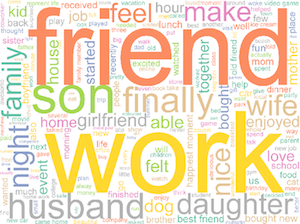

## Applied Data Science @ Columbia
## STAT GR5243/GU4243 Spring 2019 
### Project 1 An R/Python Notebook Data Story on Happy Moments



Many things can make one's heart smile with joy. [HappyDB](https://rit-public.github.io/HappyDB/) is "a corpus of 100,000 crowd-sourced happy moments". Participants were given a simple *task*:

```
What made you happy today? 

Reflect on the past 24 hours, 
and recall three actual events 
that happened to you that made you happy. 
Write down your happy moment 
in a complete sentence.
(Write three such moments.)
```
The goal of this project is to look deeper into the causes that make us happy. Natural language processing and text mining are natural tools to derive interesting findings in this collection of happy moments. 

### Challenge 

In this project you will carry out an exploratory data analysis of the corpus of [HappyDB](https://rit-public.github.io/HappyDB/) and write a blog on interesting findings.

You are tasked to explore the texts using tools from text mining and natural language processing such as sentiment analysis, topic modeling, etc, all available in `R` and write a blog post using `R` Notebook. Your blog should be in the form of a `data story` blog on interesting trends and patterns identified by your analysis of these happy moments. 

Data from the HappyDB project can be found on [GitHub](https://github.com/rit-public/HappyDB/tree/master/happydb/data). Before carrying out any analysis, you should read the [description of the data files](https://github.com/rit-public/HappyDB).

Even though this is an individual project, you are **encouraged** to discuss with your classmates online and exchange ideas. 

### Project organization

A GitHub starter codes repo will be posted on piazza for you to fork and start your own project. 

#### Suggested workflow
This is a relatively short project. We only have about two weeks of working time. In the starter codes, we provide you two basic data processing R notebooks to get you started. 

`Text_processing.rmd` cleans the text data while `HappyDB_RShiny.rmd` constrcuts a shiny app to quickly explore the data. There is not much detailed data analysis of the text data at the *moments* level, which should be the focus of your analysis.

1. [wk1] Week 1 is the **data processing and mining** week. Read data description, **project requirement**, browse data and studies the R notebooks in the starter codes, and think about what to do and try out different tools you find related to this task.
2. [wk1] Try out ideas on a *subset* of the data set to get a sense of computational burden of this project. 
3. [wk2] Explore data for interesting trends and start writing your data story. 

#### Submission
You should produce an R notebook (rmd and html files) in your GitHub project folder, where you should write a story or a blog post on happy moments based on your data analysis. Your story should be supported by your results and appropriate visualization

#### Repositary requirement

The final repo should be under our class github organization (TZStatsADS) and be organized according to the structure of the starter codes. 

```
proj/
├──data/
├──doc/
├──figs/
├──lib/
├──output/
├── README
```
- The `data` folder contains the raw data of this project. These data should NOT be processed inside this folder. Processed data should be saved to `output` folder. This is to ensure that the raw data will not be altered. 
- The `doc` folder should have documentations for this project, presentation files and other supporting materials. 
- The `figs` folder contains figure files produced during the project and running of the codes. 
- The `lib` folder contain computation codes for your data analysis. Make sure your README.md is informative about what are the programs found in this folder. 
- The `output` folder is the holding place for intermediate and final computational results.

The root README.md should contain your name and an abstract of your findings. 

### Useful resources

##### R pakcages
* R [tidyverse](https://www.tidyverse.org/) packages
* R [tidytext](https://cran.r-project.org/web/packages/tidytext/vignettes/tidytext.html)
* [Text Mining with `R`](https://www.tidytextmining.com/)
* R [DT](http://www.htmlwidgets.org/showcase_datatables.html) package
* R [tibble](https://cran.r-project.org/web/packages/tibble/vignettes/tibble.html)
* [Rcharts](http://rcharts.io/gallery/), quick interactive plots
* [htmlwidgets](http://www.htmlwidgets.org/), javascript library adaptation in R. 

##### Project tools
* A brief [guide](http://rogerdudler.github.io/git-guide/) to git.
* Putting your project on [GitHub](https://guides.github.com/introduction/getting-your-project-on-github/).

##### Examples
+ [Topic modeling](https://cran.r-project.org/web/packages/topicmodels/vignettes/topicmodels.pdf)
+ [Clustering](http://www.statmethods.net/advstats/cluster.html)
+ [Sentiment analysis of Trump's tweets](https://www.r-bloggers.com/sentiment-analysis-on-donald-trump-using-r-and-tableau/)

##### Tutorials

For this project we will give **tutorials** and give comments on:

- GitHub
- R notebook
- Example on sentiment analysis and topic modeling


